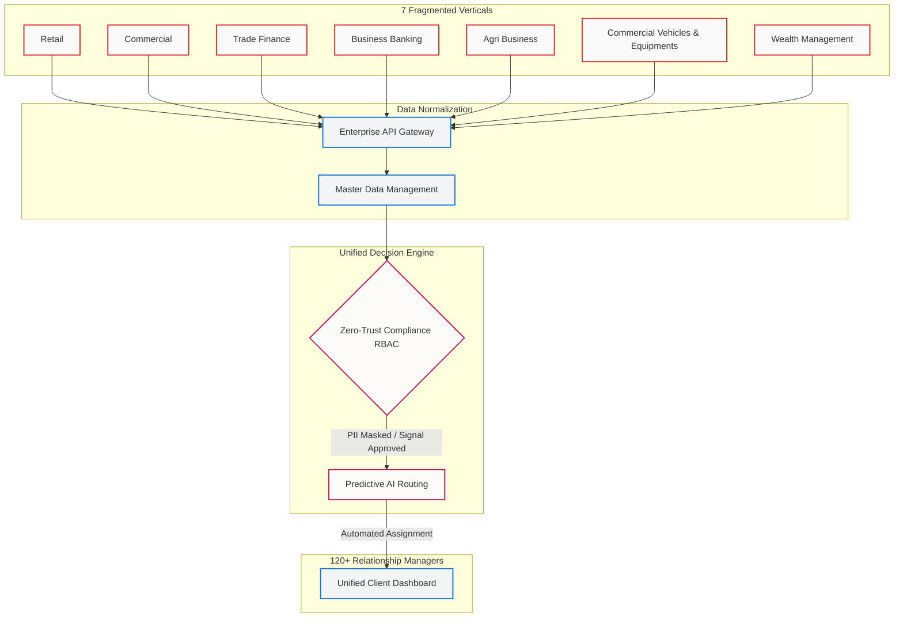
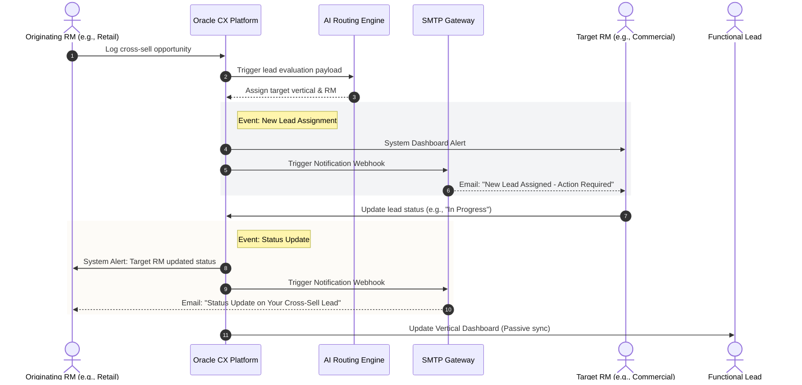

# 🏦 Federal Bank: Enterprise CRM & AI Transformation
**Architecting Zero-Leakage Data Governance and Cross-Vertical System Unification**

[](#)
[](#)
[](#)
[](#)

</div>

## 📌 Executive Summary
**Context:** Federal Bank operated 7 heavily siloed business verticals with highly fragmented data architectures. Over 120 Relationship Managers (RMs) lacked cross-departmental visibility, resulting in compounding pipeline leakage and prolonged lead conversion cycles.

**Action:** Orchestrated a 10-month, risk-gated digital transformation. Executed a "Buy and Build" strategy, selecting the Oracle CX AI platform and designing custom data governance and API integration layers. Enforced a hybrid delivery model, utilizing Atlassian Agile for engineering velocity while maintaining stringent waterfall stage-gates for Legal and Compliance UAT. 

**Result:** Delivered a unified enterprise ecosystem that digitized hand-offs, established a single source of truth, enforced SLAs via event-driven email webhooks, and eliminated pipeline leakage entirely. 

---

## 🎯 Business Value & ROI Delivered
| Metric | Pre-Transformation (Legacy) | Post-Transformation (Oracle CX) | Business Impact |
| :--- | :--- | :--- | :--- |
| **Pipeline Leakage** | Critical / Unquantifiable | **0%** | Protected top-line revenue through digitized, auditable lead hand-offs. |
| **Lead Response SLA** | Baseline | **-40%** | Accelerated conversion cycles via AI routing and event-driven email triggers. |
| **Cross-Sell Visibility** | 0% (Siloed) | **100%** | Unlocked unified client dashboards for all 120+ RMs across 7 verticals. |
| **Release Cadence** | N/A (No unified system) | **10 Months** | Accelerated Time-to-Market (TTM) via hybrid execution and phased GTM. |

---

## 🏗 Enterprise System Topology
*Architecture prioritizes regulatory data segregation while permitting cross-vertical lead signaling across all 7 previously isolated business units.*


---

## ⚙️ Event-Driven Lead Lifecycle & SLA Enforcement
To ensure the 40% reduction in lead response time was operationalized, I architected an Event-Driven Architecture (EDA) notification loop. Instead of relying on RMs to manually refresh dashboards, the system proactively pushes SMTP/email webhooks upon critical state changes, strictly enforcing SLAs.


---

## 🛡 Risk Mitigation & Zero-Trust Governance

### 1. Vendor TCO & Requirements Engineering
*   **Build vs. Buy Evaluation:** Conducted rigorous vendor matrix evaluation. Selected Oracle CX AI based on robust financial services compliance templates, superior AI routing capabilities, and multi-year TCO efficiency.
*   **BRD & Schema Mapping:** Authored exhaustive Business Requirement Documents (BRDs) mapping 7 disparate legacy data schemas into a single, normalized CRM taxonomy.

### 2. The RBAC Permissions Matrix
Designed a dynamic Role-Based Access Control matrix governed by the Principle of Least Privilege. This structure ensures Functional Leads maintain overarching pipeline auditability to unblock bottlenecks, without violating inter-departmental data privacy walls.

| Role | Scope | "Given" Leads | "Received" Leads | Status Updates | PII Visibility |
| :--- | :--- | :---: | :---: | :---: | :--- |
| **Relationship Manager (RM)** | Individual | ✅ Read / Track | ✅ Read / Write | ✅ Receive Email Alerts | Restricted to Assigned Leads Only |
| **Functional Lead** | Vertical-Scoped | ✅ Read / Audit | ✅ Read / Audit | ✅ Dashboard Access | Unrestricted within their Vertical |
| **System Admin** | Enterprise | ❌ No Access | ❌ No Access | ❌ No Access | Heavily Masked / Redacted |

---

## 🚀 Phased Go-To-Market (GTM) Strategy
Executed a 4-phase rollout, utilizing feature flags and hypercare windows to isolate operational risk from live trading environments:

1.  **Phase 1 (Retail):** Deployed core API gateways, data ingestion engines, and onboarded the highest-volume/lowest-complexity vertical. 
2.  **Phase 2 (Commercial):** Engineered complex B2B account hierarchies and multi-stakeholder mapping under new RBAC compliance rules.
3.  **Phase 3 (Trade Finance):** Executed legacy batch data migrations without active deal-flow disruption. Sunset initial legacy trackers.
4.  **Phase 4 (Enterprise Integration):** Onboarded Business Banking, Agri Business, Commercial Vehicles & Equipments, and Wealth Management. Activated AI lead scoring modules. Achieved 100% adoption across the 120+ RM fleet spanning all 7 verticals.

---

## 📂 Audit-Ready Portfolio Artifacts
*Sanitized deliverables proving execution rigor, available in the `/assets` repository.*

*   `01_Vendor_TCO_Decision_Matrix.xlsx`: Quantitative breakdown of Oracle vs. Custom Build ROI.
*   `02_Zero_Trust_RBAC_Framework.pdf`: Complete matrix detailing data masking rules between the 7 business verticals.
*   `03_Data_Ingestion_BRD_Excerpt.md`: Technical documentation governing API data hand-offs.
*   `04_UAT_Compliance_SignOff_Gates.csv`: The exact framework used to clear Legal/InfoSec blockers prior to launch.
*   `05_Event_Notification_Sequence.md`: Raw Mermaid.js architecture files for all system topology diagrams.
```
