# 🏦 Federal Bank: Enterprise CRM & AI Transformation
**Architecting Zero-Leakage Data Governance and Cross-Vertical System Unification**

## 📌 Executive Summary
**Context:** Federal Bank operated 7 heavily siloed business verticals with highly fragmented data architectures. Over 120 Relationship Managers (RMs) lacked cross-departmental visibility, resulting in compounding pipeline leakage and prolonged lead conversion cycles.

**Action:** Orchestrated a 10-month, risk-gated digital transformation. Executed a "Buy and Build" strategy, selecting the Oracle CX AI platform and designing custom data governance and API integration layers. Enforced a hybrid delivery model, utilizing Atlassian Agile for engineering velocity while maintaining stringent waterfall stage-gates for Legal and Compliance UAT. 

**Result:** Delivered a unified enterprise ecosystem that digitized hand-offs, established a single source of truth, and eliminated pipeline leakage. 

---

## 🎯 Business Value & ROI Delivered
| Metric | Pre-Transformation (Legacy) | Post-Transformation (Oracle CX) | Business Impact |
| :--- | :--- | :--- | :--- |
| **Pipeline Leakage** | Critical / Unquantifiable | **0%** | Protected top-line revenue through digitized, auditable lead hand-offs. |
| **Lead Response SLA** | Baseline | **-40%** | Accelerated conversion cycles via AI-driven predictive lead routing. |
| **Cross-Sell Visibility** | 0% (Siloed) | **100%** | Unlocked unified client dashboards for all 120+ RMs across 7 verticals. |
| **Release Cadence** | N/A (No unified system) | **10 Months** | Accelerated Time-to-Market (TTM) via hybrid execution and phased GTM. |

---

## 🏗 Enterprise Architecture & Zero-Trust Lead Routing
*Architecture prioritizes regulatory data segregation while permitting cross-vertical lead signaling.*

```mermaid
graph TD
    classDef legacy fill:#fafafa,stroke:#d32f2f,stroke-width:2px;
    classDef middleware fill:#f3f4f6,stroke:#1976d2,stroke-width:2px;
    classDef oracle fill:#fdfbf7,stroke:#c2185b,stroke-width:2px;

    subgraph Legacy Environment [Fragmented Verticals]
        R[Retail]:::legacy
        C[Commercial]:::legacy
        T[Trade Finance]:::legacy
        O[4 Other Verticals]:::legacy
    end

    subgraph Middleware & Governance [Data Normalization]
        API[Enterprise API Gateway]:::middleware
        MDM[Master Data Management]:::middleware
    end

    subgraph Oracle CX AI Cloud [Unified Decision Engine]
        RBAC{Zero-Trust Compliance RBAC}:::oracle
        AI[Predictive AI Routing]:::oracle
    end

    subgraph Execution Layer [120+ Relationship Managers]
        UI[Unified Client Dashboard]:::middleware
    end

    R --> API
    C --> API
    T --> API
    O --> API

    API --> MDM
    MDM --> RBAC
    RBAC -->|PII Masked / Signal Approved| AI
    AI -->|Automated Assignment| UI
```

---

## 🛠 Strategic Execution Levers

### 1. Vendor TCO & Requirements Engineering
*   **Build vs. Buy Evaluation:** Conducted rigorous vendor matrix evaluation. Selected Oracle CX AI based on robust financial services compliance templates, superior AI routing capabilities, and Total Cost of Ownership (TCO) efficiency over a multi-year horizon.
*   **BRD & Schema Mapping:** Authored exhaustive Business Requirement Documents (BRDs) mapping 7 disparate legacy data schemas into a single, normalized CRM taxonomy.

### 2. Risk Mitigation & Data Governance
*   **Compliance-First RBAC:** Designed strict Role-Based Access Control (RBAC) frameworks. Ensured algorithms could route cross-sell opportunities (e.g., *Retail to Trade Finance*) without violating strict internal banking data privacy boundaries. 
*   **UAT Gatekeeping:** Engineered a tiered User Acceptance Testing (UAT) framework. Production merges strictly required documented sign-off from Vertical EVPs, InfoSec, and Legal.

### 3. Phased Go-To-Market (GTM) De-risking
Executed a 4-phase rollout to isolate operational risk from live trading environments:
1.  **Phase 1 (Retail):** Deployed core API gateways, data ingestion engines, and onboarded the highest-volume/lowest-complexity vertical. 
2.  **Phase 2 (Commercial):** Engineered complex B2B account hierarchies and multi-stakeholder mapping under new RBAC compliance rules.
3.  **Phase 3 (Trade Finance):** Executed legacy data migrations without active deal-flow disruption. Sunset initial legacy trackers.
4.  **Phase 4 (Enterprise/AI):** Activated AI lead scoring modules. Achieved 100% adoption across the 120+ RM fleet spanning all 7 verticals.

---

## 📂 Audit-Ready Portfolio Artifacts
*Sanitized deliverables proving execution rigor, available in the `/assets` repository.*

*   `01_Vendor_TCO_Decision_Matrix.xlsx`: Quantitative breakdown of Oracle vs. Custom Build ROI.
*   `02_Zero_Trust_RBAC_Framework.pdf`: Matrix detailing data masking rules between the 7 business verticals.
*   `03_Data_Ingestion_BRD_Excerpt.md`: Technical documentation governing API data hand-offs.
*   `04_UAT_Compliance_SignOff_Gates.csv`: The exact framework used to clear Legal/InfoSec blockers prior to launch.
